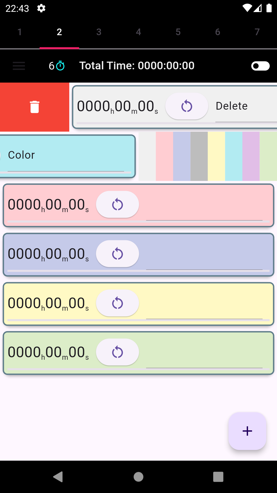

# Simple Multi Stopwatch

## 概要(Overview)
開発中のFlutterプロジェクトです。 
複数のシンプルなストップウォッチを同時利用できるアプリを目指しています。 
学習時間・作業時間などの把握に使用できます。 
 
This is a Flutter project under development.  
The goal is to create an app that allows users to use multiple simple stopwatches simultaneously. 
It can be used to track learning time, work time, etc.  

## スクリーンショット(Screenshots)

## インストール方法(Installation Instructions)

### 前提条件(Prerequisites)
Flutter SDKのインストールなど、Flutter開発環境を作成してください 
Set up your Flutter development environment, including installing the Flutter SDK. 

### 手順(Steps)
(1)リポジトリのクローン(Clone the repository) 
git clone https://github.com/MasakiNiwa/SimpleMultiStopwatch.git 
 
(2)依存関係のインストール(Install dependencies) 
cd (Project directory) 
flutter pub get 
 
(3)アプリの実行(Run the app) 
flutter run 

### 動かせなくなったとき(Troubleshooting)
(1)プロジェクトをきれいにする(Clean the project) 
flutter clean 
 
(2)プロジェクトを再構築(Rebuild the project) 
flutter pub get 

## 使い方(How to Use)
・アプリ右下の追加ボタンでストップウォッチを追加  
・Add a stopwatch by tapping the "+" button in the bottom right corner of the app.  
・右から左へのスワイプでストップウォッチの背景色を選択  
・Swipe a stopwatch from right to left to select the stopwatch background color.  
・左から右へのスワイプでストップウォッチを一つ削除  
・Swipe a stopwatch from left to right to delete it.  
・アプリ右上の削除ボタンでストップウォッチを全削除  
・Tap the "Delete All" button in the top right corner of the app to delete all stopwatches.  
・ストップウォッチを上下に移動して並び替え 
・Drag and drop stopwatches to reorder them. 
・時間表示部分のタップでストップウォッチを開始/停止  
・Tap the time display area to start/stop the stopwatch.  
・リセットボタンでストップウォッチを0に戻す  
・Tap the reset button to reset the stopwatch to 0.  
・ストップウォッチ右側にストップウォッチの内容をメモ  
・Take notes on the stopwatch on the right side of the stopwatch.  
・時間表示部分を上下にスワイプで調整画面を表示 
(調整画面では、経過時間の調整と、進捗目標時間の設定が可能です) 
・Swipe the time display area up or down to display the adjustment screen.  
(On the adjustment screen, you can adjust the elapsed time and set the progress target time.) 
・アプリを閉じてもストップウォッチの状態は保存されて、再起動時に復元されます。  
(動いていたストップウォッチは、アプリを閉じていた時間も反映して、再起動時に動作を再開します)  
・The stopwatch state is saved even when the app is closed and restored when it is restarted.  
(Running stopwatches will resume operation upon restart, reflecting the time the app was closed.)  

## お願い(Feedback)
ご意見、ご感想、バグ報告など、お気軽にIssuesやDiscussionsまたはメールでお寄せください 
masaki28.dev@gmail.com 
 
Please feel free to share your feedback, thoughts, and bug reports through Issues, Discussions or email. 
(I will do my best to respond using AI translation tools.) 
masaki28.dev@gmail.com 

## About
このアプリはMITライセンスを採用しています。 
This app is licensed under the MIT License. 
 
Flutterとその他パッケージを次のバージョンで使用しています 
This app uses Flutter and other packages with the following versions: 
・Flutter: 3.22.1 (BSD 3-Clause) 
・Shared Preferences: 2.2.3 (BSD 3-Clause) 
・Flutter Slidable: 3.1.0 (MIT) 
・Flutter Launcher Icons: 0.13.1 (MIT) 
・Flutter Markdown: 0.7.1 (BSD 3-Clause) 
・Change App Package Name: 1.1.0 (MIT) 

## 最後に(Additional Information)
現在Google Play(android)でクローズドテストを実施中です。 
詳細はDiscussionsをご覧ください。 
 
I am currently conducting a closed test on Google Play (Android). 
Please see Discussions for more details. 
 