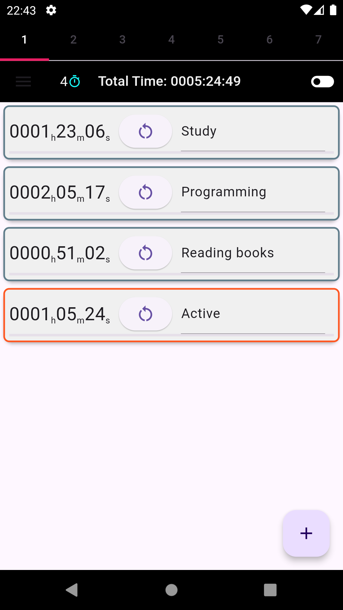

# Simple Multi Stopwatch

## 概要(Overview)
開発中のFlutterプロジェクトです。 
複数のシンプルなストップウォッチを同時利用できるアプリを目指しています。 
This is a Flutter project under development.  
The goal is to create an app that allows users to use multiple simple stopwatches simultaneously. 

## スクリーンショット(Screenshots)

## 使い方(How to Use)
・アプリ右下の追加ボタンでストップウォッチを追加  
・Add a stopwatch by tapping the "+" button in the bottom right corner of the app.  
・左から右へのスワイプでストップウォッチを一つ削除  
・Swipe a stopwatch from left to right to delete it.  
・アプリ右上の削除ボタンでストップウォッチを全削除  
・Tap the "Delete All" button in the top right corner of the app to delete all stopwatches.  
・ストップウォッチを上下に移動して並び替え 
・Drag and drop stopwatches to reorder them. 
・時間表示部分のタップでストップウォッチを開始/停止  
・Tap the time display area to start/stop the stopwatch.  
・リセットボタンでストップウォッチを0に戻す  
・Tap the reset button to reset the stopwatch to 0.  
・ストップウォッチ右側にストップウォッチの内容をメモ  
・Take notes on the stopwatch on the right side of the stopwatch.  
・アプリを閉じてもストップウォッチの状態は保存されて、再起動時に復元されます。  
　(動いていたストップウォッチは、アプリを閉じていた時間も反映して、再起動時に動作を再開します)  
・The stopwatch state is saved even when the app is closed and restored when it is restarted.  
　(Running stopwatches will resume operation upon restart, reflecting the time the app was closed.)  

## 把握しているバグ(Known Bugs)
### 頻度は少ないがデバッグ中にアプリが停止する The app may crash during debugging.
_AssertionError('package:flutter/src/rendering/layer.dart':Failed assertion:line 2692 pos 7:'_debugCheckLeaderBeforeFollower(forwardLayers, inverseLayers)':LeaderLayer anchor must come before FollowerLayer in paint order, but the reverse was true.) 
 
発生開始時期：ReorderableListViewを使用開始した頃から 
発生状況：短時間でストップウォッチを連続して激しく動かす操作をおこなったときが多い 
現時点の予想１：ReorderableListViewの使い方が論理的におかしい？ 
現時点の予想２：TextFieldとReorderableListViewが干渉？ 
Start of occurrence: Around the time ReorderableListView started being used 
Occurrence conditions: Often occurs when multiple stopwatches are manipulated quickly in a short period of time 
Current hypothesis 1: Is the usage of ReorderableListView logically incorrect? 
Current hypothesis 2: Interference between TextField and ReorderableListView? 
 
★スワイプと並べ替えが同時に発動するようなタイミングで止まる傾向を発見 
・DismissedとReorderableListViewの干渉を防ぐ対応を考えてみる 
★I have discovered a tendency to stop at a timing when swiping and reordering seem to occur simultaneously. 
・I will consider how to deal with the interference between Dismissed and ReorderableListView. 

## 現在の取り組み(Current Work)
実機テスト中です 
実際に使って改善点を探してみます 
Real device testing is in progress. 
I will try to find improvement points by actually using it. 

## 直近の目標(Next Steps)
(1)まずはバグを取り除く(Fix bugs) 
(2)コメントの見直し(Review code comments) 

## 今後の目標(Future Goals)
(1)コードを整理しなおす(Refactor code) 
(2)デザインを見直す(Redesign) 
(3)アプリを公開する(Publish app) 

## その他(Additional Notes)
・まだ開発中のため、不具合が含まれていたらすみません 
・不具合のご指摘や、アドバイス等ありましたらご教授お願いいたします 
・このプロジェクトが誰かの役にたてたら嬉しいです 
・This app is still under development and may contain bugs. 
・Please feel free to report any bugs or suggestions you have. 
・I hope you find this app useful! 